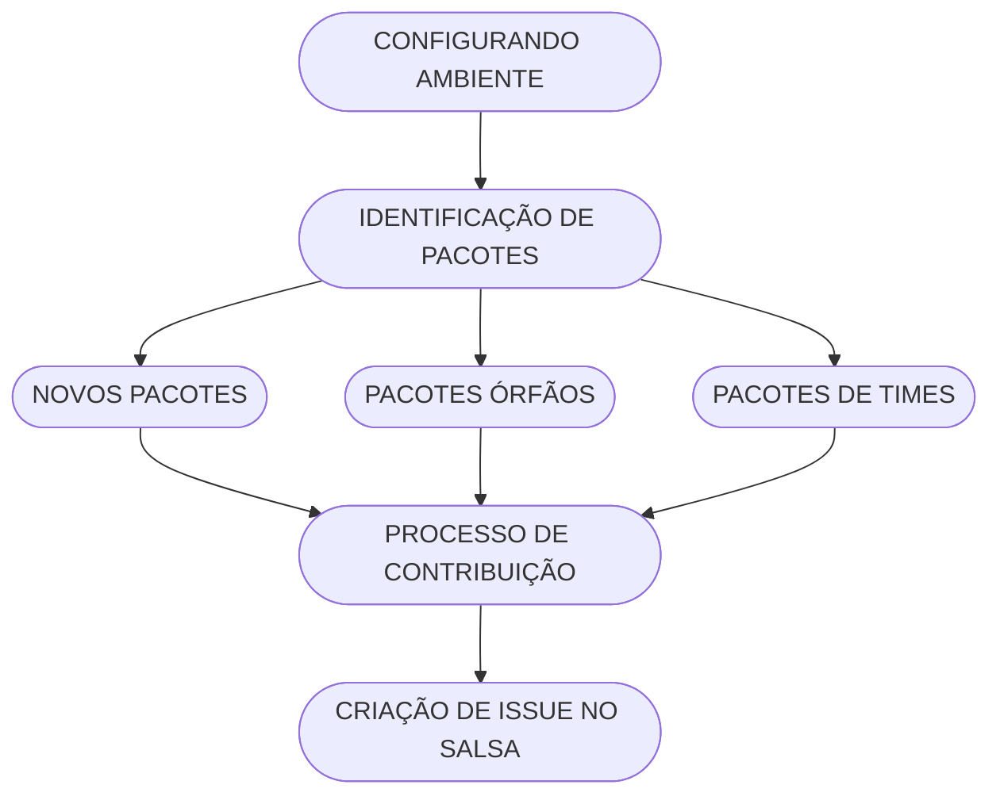

## 🔄 Checklist para Cada Pacote

- [ ] Diretório `debian/` criado.
- [ ] Arquivos obrigatórios escritos (`control`, `rules`, etc).
- [ ] Build bem-sucedido em ambiente isolado.
- [ ] Instalação e remoção testadas.
- [ ] Validação com `lintian` realizada.
- [ ] Pacote assinado (se aplicável).
- [ ] Documentação interna atualizada.

---

## Checklist antes de enviar um Pull Request

- [ ] O pacote constrói sem erros (`dpkg-buildpackage -us -uc`).
- [ ] O pacote passou nas verificações do `lintian`.
- [ ] O `debian/changelog` foi atualizado.
- [ ] O código está documentado quando aplicável.
- [ ] Os commits seguem a convenção abaixo.

## 🚀 Roadmap

