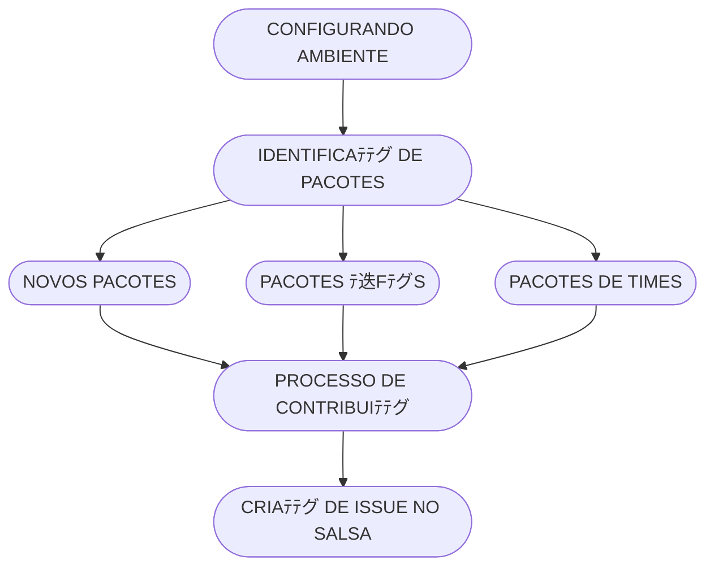

## 売 Checklist para Cada Pacote

- [ ] Diretﾃｳrio `debian/` criado.
- [ ] Arquivos obrigatﾃｳrios escritos (`control`, `rules`, etc).
- [ ] Build bem-sucedido em ambiente isolado.
- [ ] Instalaﾃｧﾃ｣o e remoﾃｧﾃ｣o testadas.
- [ ] Validaﾃｧﾃ｣o com `lintian` realizada.
- [ ] Pacote assinado (se aplicﾃ｡vel).
- [ ] Documentaﾃｧﾃ｣o interna atualizada.

---

## Checklist antes de enviar um Pull Request

- [ ] O pacote constrﾃｳi sem erros (`dpkg-buildpackage -us -uc`).
- [ ] O pacote passou nas verificaﾃｧﾃｵes do `lintian`.
- [ ] O `debian/changelog` foi atualizado.
- [ ] O cﾃｳdigo estﾃ｡ documentado quando aplicﾃ｡vel.
- [ ] Os commits seguem a convenﾃｧﾃ｣o abaixo.

## 噫 Roadmap

