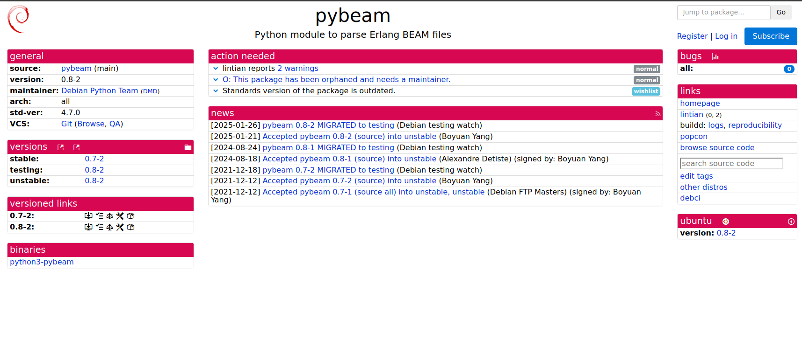
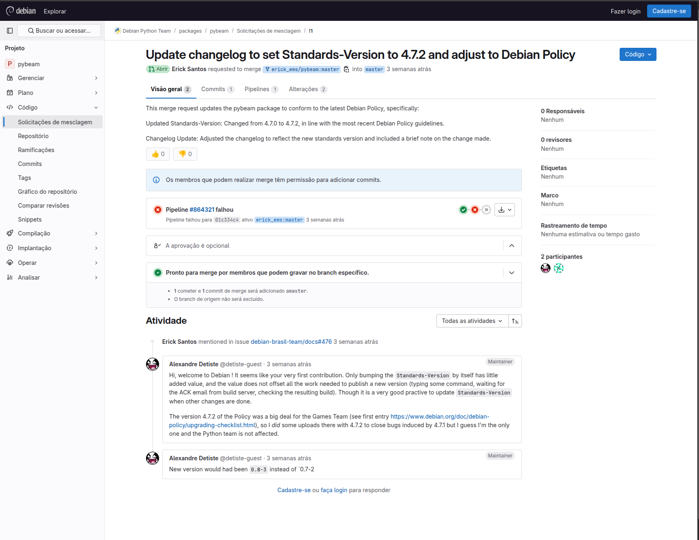
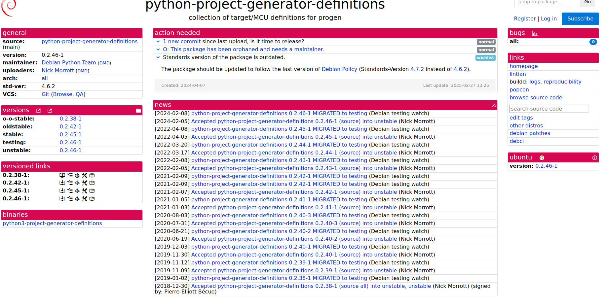
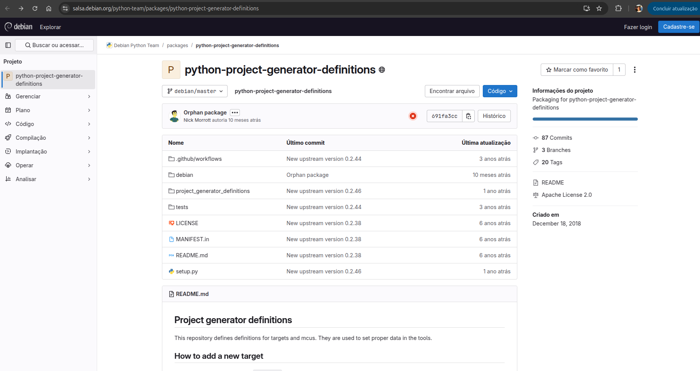
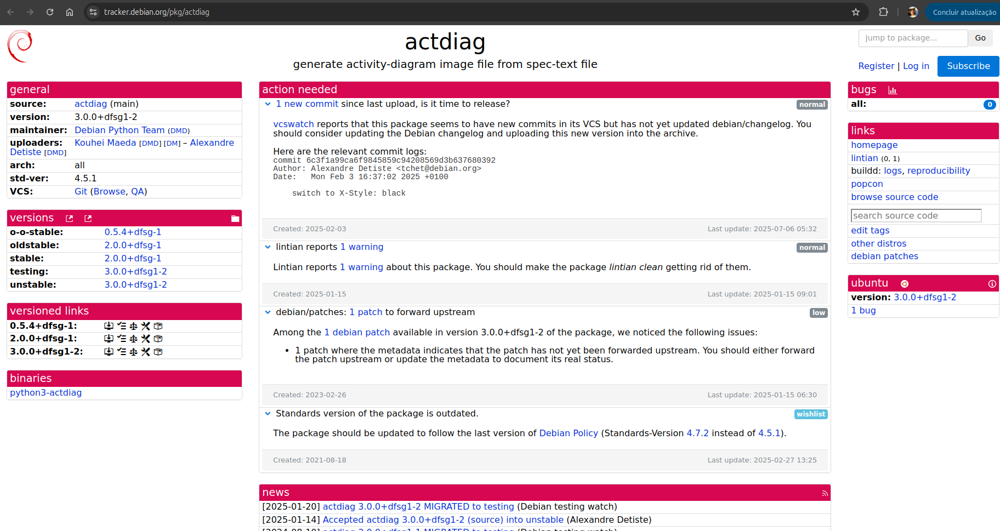

# Atualização do Pacote pybeam

## Descrição do Pacote
pybeam é um módulo em Python desenvolvido para analisar e extrair informações de arquivos BEAM, que são os arquivos de bytecode compilados da linguagem Erlang, executados pela máquina virtual Erlang (BEAM VM). Esses arquivos contêm a representação intermediária de módulos Erlang compilados, incluindo funções, atributos, metadados e outros blocos estruturais.

## Alterações Realizadas

Este *merge request* atualiza o pacote **pybeam** para estar em conformidade com a versão mais recente da Política do Debian, especificamente:

* **Versão dos Padrões Atualizada**: Alterada de 4.7.0 para 4.7.2, em conformidade com as diretrizes mais recentes da Política do Debian.
* **Atualização do Changelog**: O changelog foi ajustado para refletir a nova versão dos padrões e inclui uma breve nota sobre a alteração realizada.

# Atualização do Pacote python-project-generator-definitions

## Descrição do pacote
python-project-generator-definitions é uma coleção de definições de alvos e MCUs (microcontroladores) utilizada pelo progen (Project Generator), uma ferramenta para geração de projetos multi-plataforma para desenvolvimento embarcado.
As definições permitem configurar corretamente os parâmetros de compiladores, IDEs e toolchains para diferentes ambientes e dispositivos.

## Alterações Realizadas
Esta alteração faz o pacote python-project-generator-definitions compatível com a política mais recente do Debian.

# Atualização do Pacote actdiag

## 📦 Descrição do Pacote

**actdiag** é uma ferramenta que gera imagens de **diagramas de atividades (activity diagrams)** a partir de arquivos de texto com sintaxe declarativa.
Ela é especialmente útil em fluxos de documentação automatizada e integração com sistemas como Sphinx, permitindo visualizar processos de forma clara e visual.

> Este pacote fornece o módulo Python `python3-actdiag`, que interpreta os arquivos `.diag` e gera saídas SVG/PNG usando bibliotecas gráficas como `blockdiag` e `Pillow`.

---

## ✅ Alterações Realizadas

Este alteração propõe uma atualização técnica e de manutenção do pacote **actdiag**, incluindo:

- **📌 Atualização da Política Debian**:
  - A **Standards-Version** foi atualizada de `4.5.1` para `4.7.2`, conforme a [Debian Policy](https://www.debian.org/doc/debian-policy/).
  - Nenhuma mudança funcional foi necessária para compatibilidade com a nova política.

- **🧹 Estilo de Código Padronizado**:
  - Aplicação do formato **Black** (`X-Style: black`) ao código, conforme o commit `6c3f1a99`.

- **📎 Patch Local Avaliado**:
  - O pacote possui um patch em `debian/patches/` sem informação de encaminhamento upstream.
  - A metadata foi mantida, mas recomenda-se revisão para confirmar se o patch pode ser enviado ao projeto original.

- **📝 Atualização do Changelog**:
  - O `debian/changelog` foi modificado para registrar a atualização da política e a mudança de estilo.

---

## 🛠️ Situação do Pacote

- **Versão atual**: `3.0.0+dfsg1-2`
- **Distribuições**: `testing`, `unstable`
- **Arquitetura**: `all`
- **Mantenedores**: Debian Python Team (DMD)
- **Uploaders**: Kouhei Maeda, Alexandre Detiste

---

## 📌 Ação Sugerida

- [ ] Subir uma nova versão com a **Standards-Version** atualizada (`4.7.2`)
- [ ] Confirmar a situação do patch pendente e atualizar o campo `Forwarded` se necessário
- [ ] Corrigir o aviso reportado pelo `lintian`
- [ ] Atualizar o `debian/changelog` com as alterações acima

---

## 🔗 Referências

- [Repositório no Salsa](https://salsa.debian.org/python-team/packages/actdiag)
- [Página do pacote no tracker Debian](https://tracker.debian.org/pkg/actdiag)
- [Commits pendentes](https://salsa.debian.org/python-team/packages/actdiag/-/commits/master)
- [Lintian](https://lintian.debian.org/)
