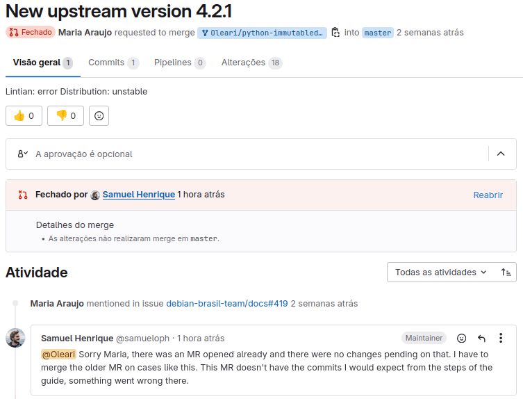
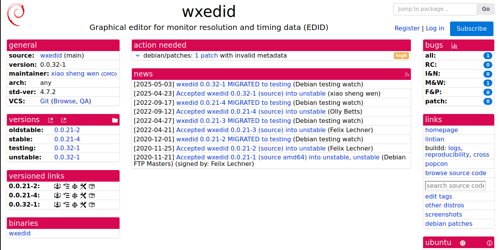
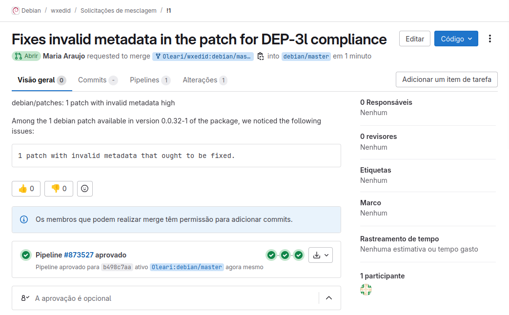

# Atualização do Pacote python-humanize

## Descrição do Pacote

O pacote **python-humanize** oferece uma série de utilitários de humanização, como converter números em durações legíveis para o ser humano (por exemplo, "3 minutos atrás") ou em tamanhos ou taxas de transferência legíveis. Este pacote é útil em aplicações que precisam exibir informações de maneira mais amigável para os usuários.


## Alterações Realizadas

- **Atualização para a versão upstream 4.12.2**: A versão mais recente foi integrada ao pacote.
- **Atualização da versão de standards**: A versão de standards do pacote foi atualizada para refletir as melhores práticas do Debian, garantindo conformidade com as políticas mais recentes.
  
## Detalhes Técnicos

- **Versão Upstream**: 4.12.2
- **Versão Debian**: 4.12.2-1

## Links Úteis

- **Tracker do Pacote**: https://salsa.debian.org/python-team/packages/python-humanize
- **Repositório do Salsa**: https://salsa.debian.org/python-team/packages/python-humanize
- **Issue**: https://salsa.debian.org/debian-brasil-team/docs/-/issues/473


# Atualização do Pacote python-immutabledict

## Descrição do Pacote

O pacote python-immutabledict fornece uma implementação de dicionário imutável para Python, permitindo a criação de objetos de mapeamento que não podem ser modificados após sua criação. Este recurso é útil para garantir a integridade de dados em aplicações que exigem estruturas de dados seguras e estáveis.


## Alterações Realizadas

- Atualização para a versão upstream 2.2.4: A versão mais recente foi integrada ao pacote.
- Atualização da versão de standards: A versão de standards do pacote foi atualizada para refletir as melhores práticas do Debian, garantindo conformidade com as políticas mais recentes.

## Detalhes Técnicos

- Versão Upstream: 2.2.4
- Versão Debian: 2.2.4-1

## Links Úteis

- Tracker do Pacote: https://tracker.debian.org/pkg/python-immutabledict

- Repositório do Salsa: https://salsa.debian.org/python-team/packages/python-immutabledict

- Lintian: https://udd.debian.org/lintian/?packages=python-immutabledict

- Merge Request: https://salsa.debian.org/python-team/packages/python-immutabledict/-/merge_requests/2 



# Patch para o Pacote `wxedid`

## Descrição do Pacote

O pacote `wxedid` é uma aplicação gráfica que permite ler e interpretar os dados EDID de monitores, facilitando a identificação de problemas de configuração e compatibilidade de displays.



## Patch Realizado

Foi desenvolvido um patch para corrigir erros. Metadados DEP-3 ausentes ou inválidos: corrigidos diretamente no patch.

Aplicando o Cabeçalho DEP-3:

```diff
Description: Corrige o problema X relacionado a Y
Author: Seu Nome <seu.email@exemplo.com>
Bug-Debian: https://bugs.debian.org/123456
Forwarded: no
Last-Update: 2025-06-01
```

> Os campos mínimos recomendados são Description, Author, Forwarded, e Last-Update. Veja mais detalhes aqui: https://dep-team.pages.debian.net/deps/dep3/

###  Detalhes do Patch

- Patch armazenado em `debian/patches/spelling.patch`.

##  Ferramentas e Procedimentos

### Utilização do `quilt`:

```bash
export QUILT_PATCHES=debian/patches
export QUILT_REFRESH_ARGS="--no-timestamps --no-index -p ab"

quilt push -a             # Aplica todos os patches
nano debian/patches/spelling.patch  # Edita o patch
quilt refresh             # Atualiza o patch após modificações
```

### Build e Validação:

```bash
quilt pop -a              # Remove todos os patches
debuild clean             # Limpa a build anterior
quilt push -a             # Aplica novamente os patches
debuild -us -uc           # Constrói o pacote
```

##  Links Úteis

- Link do Tracker: https://tracker.debian.org/pkg/wxedid

- Link do Salsa: https://salsa.debian.org/debian/wxedid

- Link do lintian do pacote (se existir): https://udd.debian.org/lintian/wxedid

- Link do Merge Request: debian/wxedid!1

