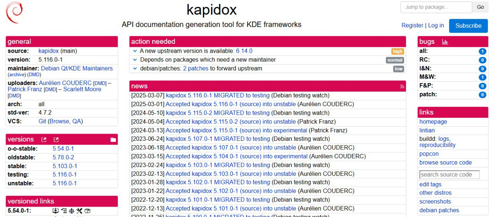
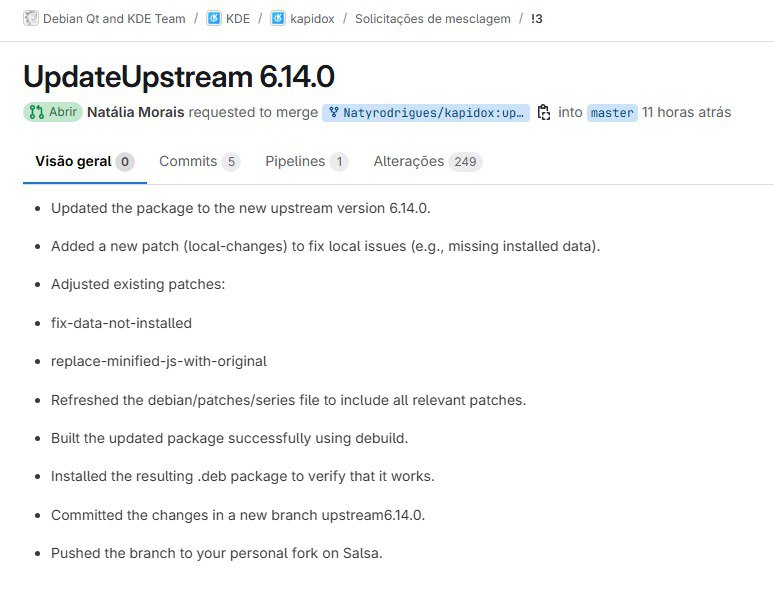
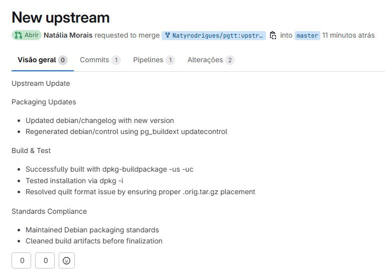
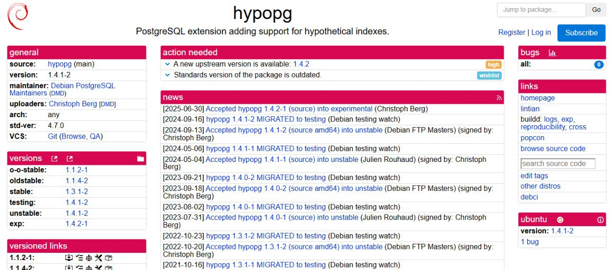
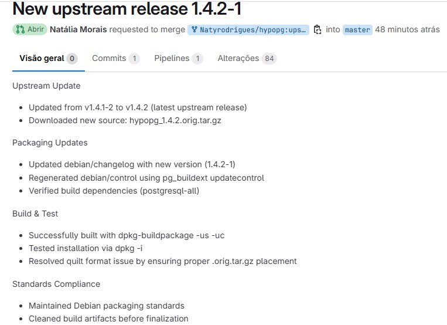
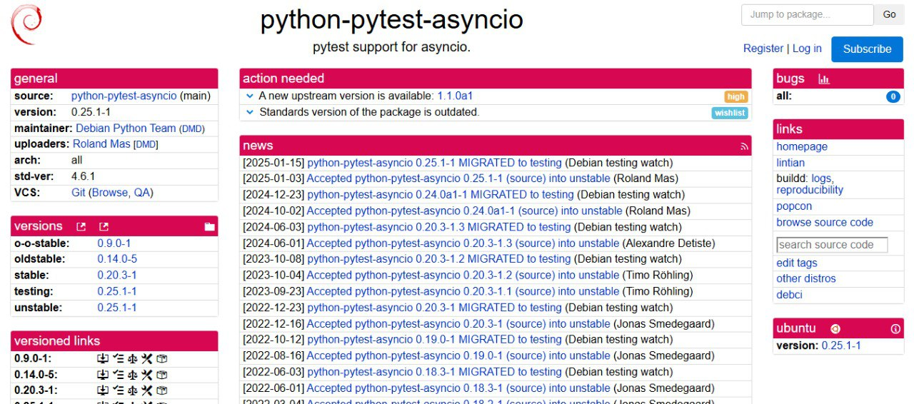
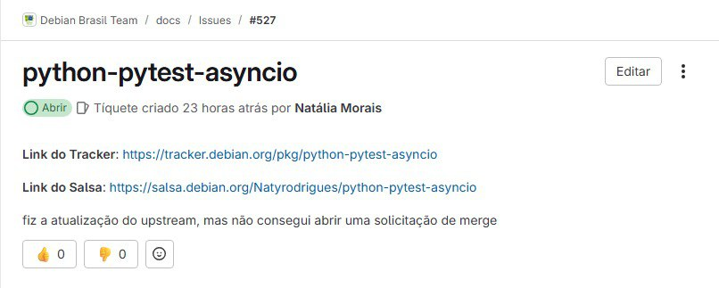

# Atualização do Pacote kapidox

## Descrição do Pacote
Ferramenta de geração de documentação de API para frameworks KDE

## Alterações Realizadas

## Links Úteis

- Link do Tracker: https://tracker.debian.org/pkg/kapidox
- Link do Salsa: https://salsa.debian.org/qt-kde-team/kde/kapidox
- **Link da Merge Request **: qt-kde-team/kde/kapidox!3
- Link do lintian do pacote: https://udd.debian.org/lintian/?packages=kapidox

# Atualização do Pacote pgtt

## Alterações Realizadas

## Links Úteis
- issue: https://salsa.debian.org/debian-brasil-team/docs/-/issues/530
- merge: https://salsa.debian.org/postgresql/pgtt/-/merge_requests/1
- tracker: https://tracker.debian.org/pkg/pgtt
- lintian: https://udd.debian.org/lintian/?packages=pgtt

# Atualização do Pacote hypopg

## Alterações Realizadas

## Links Úteis

- issue: https://salsa.debian.org/debian-brasil-team/docs/-/issues/529
- merge: https://salsa.debian.org/postgresql/hypopg/-/merge_requests/1
- tracker: https://tracker.debian.org/pkg/hypopg
- lintian: https://udd.debian.org/lintian/?packages=hypopg

# Atualização do Pacote python-pytest-asyncio

# Atualização do Pacote hypopg

## Alterações Realizadas

- issue: https://salsa.debian.org/debian-brasil-team/docs/-/issues/527
- tracker: https://tracker.debian.org/pkg/python-pytest-asyncio
- lintian: https://udd.debian.org/lintian/?packages=python-pytest-asyncio
