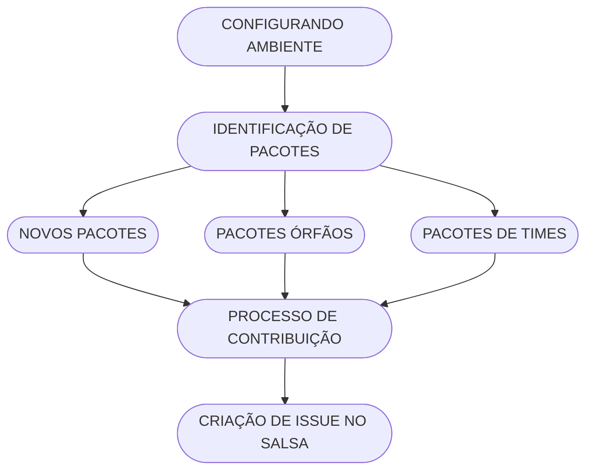
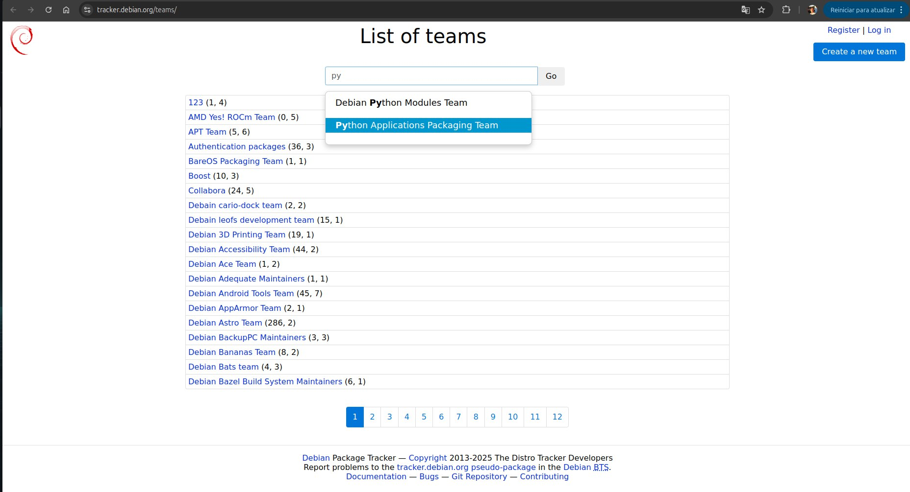
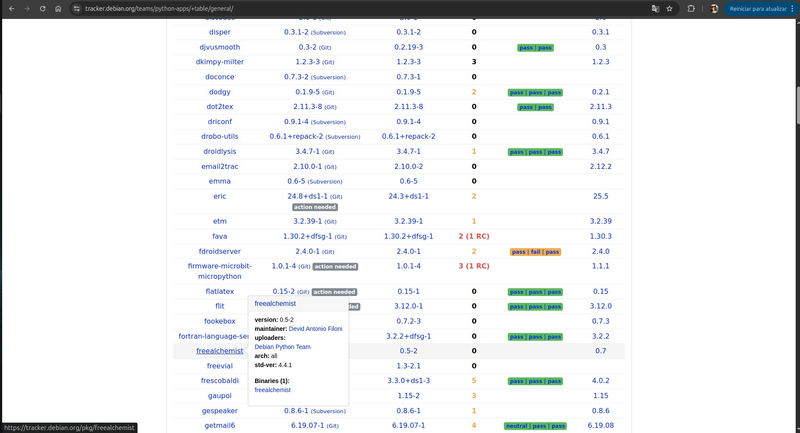
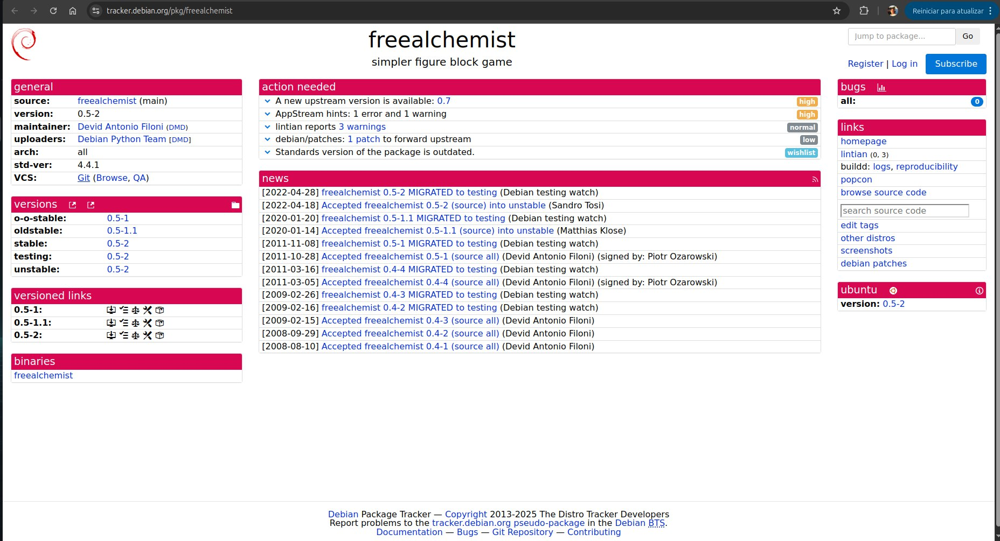
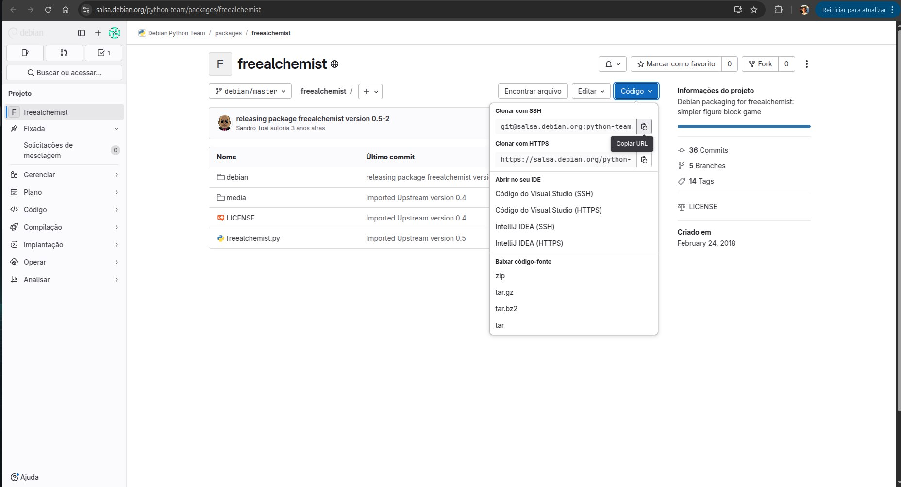
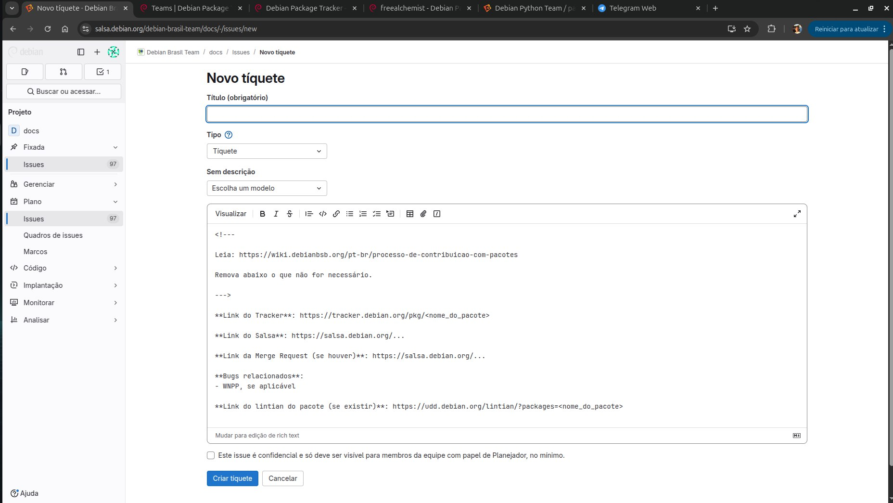

## 🚀 Roadmap

```mermaid
graph TD
    A([CONFIGURANDO AMBIENTE]) --> B([IDENTIFICAÇÃO DE PACOTES])
    B --> C([NOVOS PACOTES])
    B --> D([PACOTES ÓRFÃOS])
    B --> E([PACOTES DE TIMES])
    C --> F([PROCESSO DE CONTRIBUIÇÃO])
    D --> F([PROCESSO DE CONTRIBUIÇÃO])
    E --> F([PROCESSO DE CONTRIBUIÇÃO])
    F --> G([CRIAÇÃO DE ISSUE NO SALSA])

    click A "https://debianbrasil.org.br/empacotamento/configurando-seu-ambiente"
    click B "https://www.debian.org/distrib/packages#view"
    click C "https://ftp-master.debian.org/new.html"
    click D "https://www.debian.org/devel/wnpp/orphaned"
    click E "https://tracker.debian.org/teams/"
    click F "https://debianbrasil.org.br/processo-de-contribuicao-com-pacotes"
    click G "https://salsa.debian.org/debian-brasil-team/docs/-/issues/new"

```

## Identificação de pacotes (Pacotes de times)

## Time python

## Tracker do pacote

## Git do pacote

## Criação da issue
