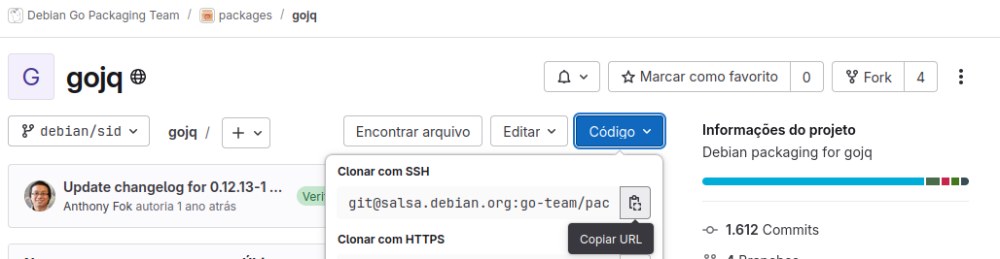
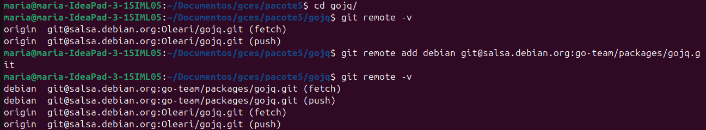
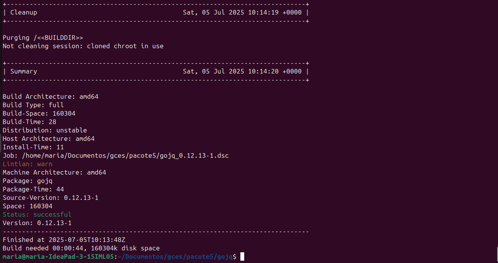
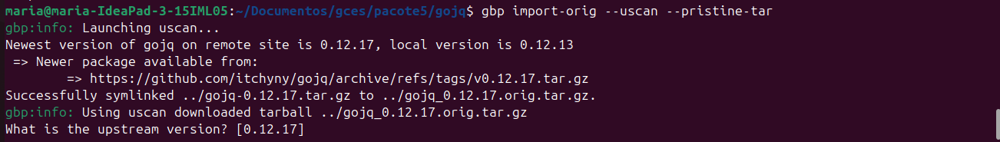
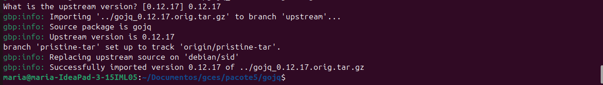
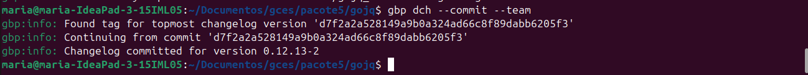
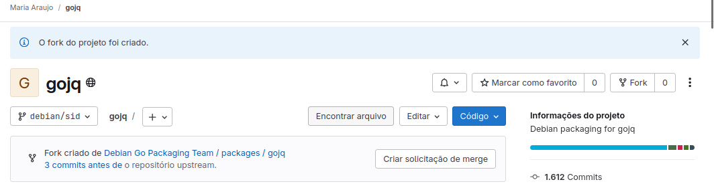
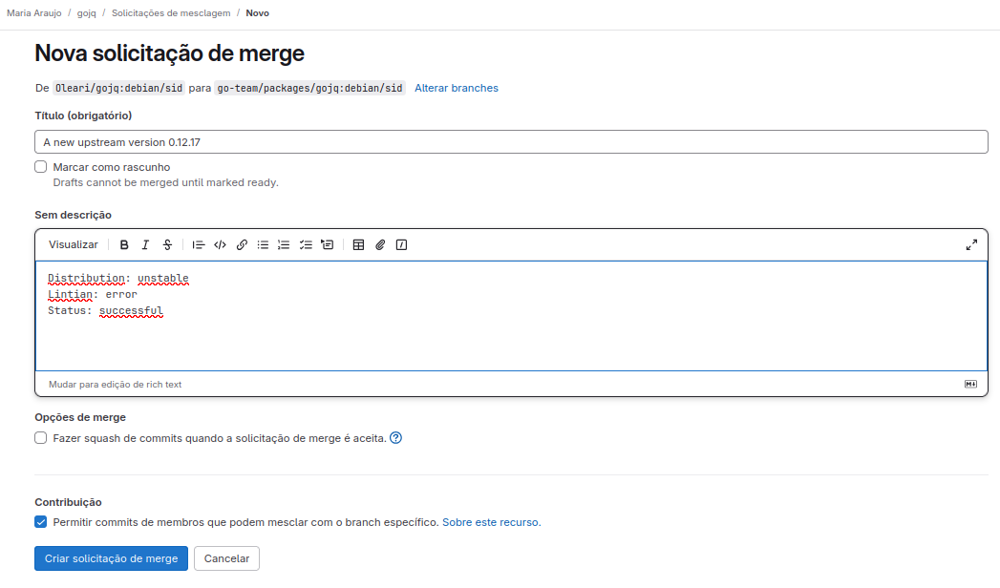
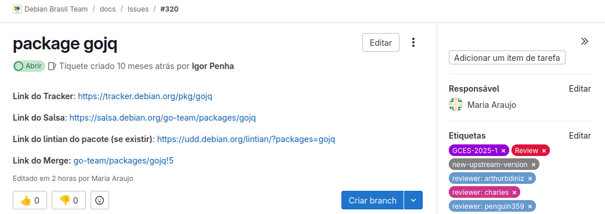

# Tutorial de Atualização Upstream para Projeto Debian

Antes de continuar nesse tutorial, saiba que para fazer a sua primeira atualização upstream você deve ter criado e ter sua senha no salsa aceita e o ambiente de empacotamento configurado.

## O que é Atualização Upstream?

Atualizar um pacote para uma nova versão **upstream** significa incorporar as mudanças feitas no código original do projeto pelo seu autor. Essa é uma das contribuições mais comuns no empacotamento Debian e ideal para quem está começando. 

Pode ser uma tarefa simples (demorar poucos minutos) ou exigir análise aprofundada e trabalho em grupo, especialmente quando há mudanças estruturais ou problemas de build.

## Passo 1: Atualizar o chroot


Execute antes de começar qualquer empacotamento (idealmente uma vez por semana ou antes de começar qualquer empacotamente):

```bash
sudo sh /usr/share/doc/sbuild/examples/sbuild-debian-developer-setup-update-all
```

## Passo 2: Fazer o Fork

1. Vá até o repositório oficial do pacote no Salsa.
2. Clique em **Fork** (canto superior direito).
3. Copie o link de **clone via SSH**.




No terminal:

```bash
# Clona o repositório
gbp clone [link-copiado]
# Entre na pasta do pacote
cd [nome_do_pacote]
# Visualize os repositórios remotos configurados no seu repositório Git local.
git remote -v
# Adicione o repositório oficial.
git remote add debian [link-repositorio-oficial-ssh]
git remote -v
```

As saídas esperadas devem ser parecidas com essa imagem:


## Passo 3: Buildar

```bash
gbp buildpackage
```

Se falhar, especifique a branch correta:

```bash
gbp buildpackage --git-debian-branch=[nome-da-branch]
```

Essa parte é a mais demorada do processo. Depois de alguns minutos, caso esteja tudo correto, o build será feito corretamente e terá no final uma saída assim:



Uma saída parecida com a da cima indica que está tudo certo.

## Passo 4: Atualizar para nova versão upstream

```bash
# Atualizar o pacote
gbp import-orig --uscan --pristine-tar
```

A saída esperada é a seguinte:



> Quando aparecer a pergunta `What is the upstream version?`, digite o número da nova versão sugerida (ex: `1.2.3`), se estiver correto com o tracker.

A saída será algo do tipo: 




## Passo 5: Operações git

```bash
gbp dch --commit --team
```

Esse comando irá fazer o commit e inserir no documento debian/changelog que o empacotamento está sendo feito de forma Team Upload. Isso é necessário para o seu empacotamento, caso não esteja nesse documento, o seu build final poderá falhar.

Saída esperada:



Depois, visualize os commits:

```bash
git log
```

Você irá visualizar toda a história dos commits feitos. É importante realizar esse passo pois na próxima etapa você irá precisar do hash do commit da branch upstream para fazer a revisão.

## Passo 6: Revisão

Essa parte é essencial na atualização upstream. Você irá revisar as mudanças feitas e ficar atendo as modificações como:
- Dependências novas e alteradas;
- Mudanças de licenças;
- Checagem geral para verificar as mudanças feitas.
- Erro de Lintian

```bash
git show [hash-do-commit-upstream]
git diff
```

Caso tenha alguma modificação significativa, ela deve ser reportada. As mudanças podem resultar em diferentes cenários, por isso, na dúvida sempre entrar em contato com a sua equipe Debian. Feita a revisão podemos seguir em frente.

## Passo 7: Finalizando

Abra o changelog para editar manualmente, pode usar seu editor de texto preferido, nesse caso foi usado o vim:

```bash
nvim debian/changelog
```

> No `vim`, digite `i` para editar, `Esc` para sair, `:wq` para salvar.


Uma dica importante é que você deve commitar os arquivos que editou separadamente. Por exemplo, se você precisou editar além do changelog, o arquivo watch, você fará um commit para o changelog e outro para o watch.

```bash
git add debian/changelog
git commit --amend
```

```bash
git add debian/watch
git commit --amend
```

# Passo 8: Fazer o build final com as novas alterações

```bash
gbp buildpackage
```

Após esse passo muitos cenários diferentes podem acontecer, cabe ao empacotador analisar o que precisa ser feito a partir daqui. Sempre que tiver dúvida, entre em contato com alguém da equipe. 

> Ignore o erro do lintian "unreleased-changes", ele é esperado neste estágio.


# Passo 9: Push e Merge

```bash
git push --all
git push --tags
```

Feito isso, entre no seu repositório fork, o salsa já irá reconhecer que houve mudanças e irá sugerir que seja feito um merge request, basta clicar em "Criar solicitação de merge". Então você irá no repositório oficial e seguir os passos que o próprio salsa pede para realizar o Merge.



É importante editar em inglês! O título deve ser representativo com as mudanças feita! Exemplo:


Lembrete: geralmente o merge request ocorre direto para a master, porém, no debian também pode ocorrer da branch master ser nomeada como debian/sid, que é equivalente à master, então não se assuste você está no caminho certo!

Após isso inclua os links importantes, e as etiquetas adequadas. Exemplo:


## Passo 10: Revisão
Agora o seu pacote será revisado por algum DM do Debian. É só aguardar e ficar de olho nos comentários, pois o seu revisor poderá sugerir alterações.

> ⚠️ **Nota:** Este tutorial é um material introdutório criado por iniciantes. Pode conter simplificações ou omissões. Consulte sempre a documentação oficial ou membros experientes do time para dúvidas específicas.