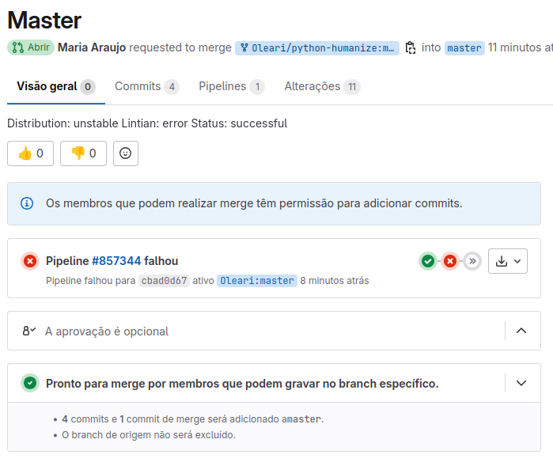
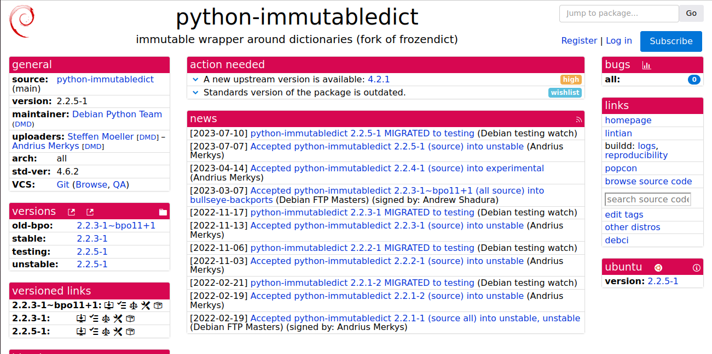
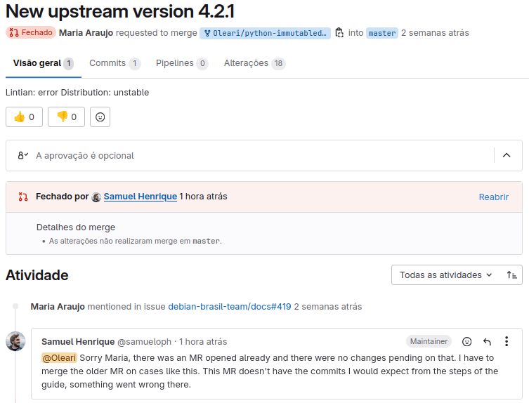

# Atualização do Pacote python-humanize

## Descrição do Pacote

O pacote **python-humanize** oferece uma série de utilitários de humanização, como converter números em durações legíveis para o ser humano (por exemplo, "3 minutos atrás") ou em tamanhos ou taxas de transferência legíveis. Este pacote é útil em aplicações que precisam exibir informações de maneira mais amigável para os usuários.

## Alterações Realizadas

- **Atualização para a versão upstream 4.12.2**: A versão mais recente foi integrada ao pacote.
- **Atualização da versão de standards**: A versão de standards do pacote foi atualizada para refletir as melhores práticas do Debian, garantindo conformidade com as políticas mais recentes.
  
## Detalhes Técnicos

- **Versão Upstream**: 4.12.2
- **Versão Debian**: 4.12.2-1

## Links Úteis

- **Tracker do Pacote**: https://salsa.debian.org/python-team/packages/python-humanize
- **Repositório do Salsa**: https://salsa.debian.org/python-team/packages/python-humanize
- **Issue**: https://salsa.debian.org/debian-brasil-team/docs/-/issues/473

# Atualização do Pacote python-immutabledict

## Descrição do Pacote

O pacote python-immutabledict fornece uma implementação de dicionário imutável para Python, permitindo a criação de objetos de mapeamento que não podem ser modificados após sua criação. Este recurso é útil para garantir a integridade de dados em aplicações que exigem estruturas de dados seguras e estáveis.

## Alterações Realizadas

- Atualização para a versão upstream 2.2.4: A versão mais recente foi integrada ao pacote.
- Atualização da versão de standards: A versão de standards do pacote foi atualizada para refletir as melhores práticas do Debian, garantindo conformidade com as políticas mais recentes.

## Detalhes Técnicos

- Versão Upstream: 2.2.4
- Versão Debian: 2.2.4-1

## Links Úteis

- Tracker do Pacote: https://tracker.debian.org/pkg/python-immutabledict

- Repositório do Salsa: https://salsa.debian.org/python-team/packages/python-immutabledict

- Lintian: https://udd.debian.org/lintian/?packages=python-immutabledict

- Merge Request: https://salsa.debian.org/python-team/packages/python-immutabledict/-/merge_requests/2 

